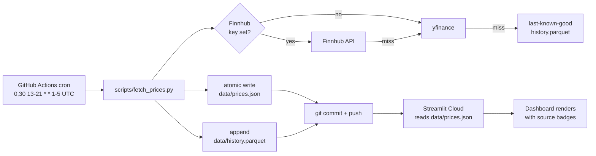

# WM Growth Portfolio — Local Dashboard

Local Streamlit dashboard for the WM Growth Portfolio. Reads positions from
`WM_Growth_Portfolio_Apr2026.xlsx`, applies IPS v1.0 constraints, pulls
delayed quotes from `yfinance`, and renders a 5-page interface in the
grayscale institutional style used by the printed reports.

## Install

```bash
cd "/Users/aaronhart/Desktop/Claude Portfolio/wm-dashboard"
python3 -m venv .venv
.venv/bin/pip install -e ".[dev]"
```

(Python 3.11+ required.)

## Run

```bash
.venv/bin/streamlit run app.py
```

Then open the URL Streamlit prints (default `http://localhost:8501`).
**To refresh:** just reload the browser tab. Cached data has a 15-minute TTL
for live quotes and a 60-minute TTL for daily history; the workbook is
re-read on every page load.

## Tests

```bash
.venv/bin/pytest
```

38 tests covering:
- IPS check thresholds at each major constraint (under / at / over).
- TWR chaining including the confirmed inception number (+4.867%).
- What-If trade simulator: post-trade weights, IPS re-check, error paths.

## Pages

1. **Dashboard** — positions table with live drift highlighting; IPS status
   panel; active-trigger panel from `config/triggers.yaml`.
2. **Performance** — TWR vs benchmark cumulative growth; risk-metric cards
   (vol / TE / beta / Sharpe / Sortino / IR / MDD) each with their IPS limit.
3. **What-If Trade** — stage a buy/sell, see post-trade weights and an
   instant IPS re-check. Trades stay in session memory; nothing is written
   back to the workbook.
4. **Reports** — links to `Daily_*.docx` / `Weekly_*.docx` files in the
   portfolio folder, newest first.
5. **IPS** — read-only display of all constraints from `config/ips.yaml`,
   plus a link to the binding `.docx`.

## Editing the operational config

| File | What lives there |
|---|---|
| `config/ips.yaml` | The hard limits from IPS v1.0. Source of truth is the docx. |
| `config/triggers.yaml` | Active triggers shown on the Dashboard. Edit in place. |
| `config/targets.yaml` | Target weights (used for drift calculation). |
| `config/benchmarks.yaml` | Benchmark ticker/label. |

To add or remove a trigger, edit `config/triggers.yaml` and reload the page.

## Provenance vocabulary

Every price column is tagged per IPS §7:
- `SOURCED` — fresh from yfinance during this request.
- `CACHED` — read from the parquet cache within TTL.
- `STALE` — yfinance failed; we are showing the previous cached value (or
  nothing). Surfaced in red on the Dashboard.

## Project layout

```
wm-dashboard/
  pyproject.toml
  README.md
  app.py
  .streamlit/config.toml          # pins the institutional light theme
  .github/workflows/
    fetch-prices.yml              # cron: refresh prices every 30 min
  scripts/
    fetch_prices.py               # CLI entry point for the cron
  config/
    ips.yaml
    benchmarks.yaml
    triggers.yaml
    targets.yaml
    tickers.yaml                  # universe to refresh on the cron
  src/wm_dashboard/
    __init__.py
    tracker.py                    # read positions from xlsx
    prices.py                     # repo snapshot -> parquet cache -> yfinance
    price_providers.py            # Finnhub + yfinance adapters
    twr.py                        # wraps risk_attribution.chain_twr
    ips_check.py                  # constraint engine
    whatif.py                     # stage a trade and re-check
    reports_index.py              # list Daily/Weekly/Quarterly/IPS .docx files
    risk_attribution.py           # Sharpe / Sortino / vol / beta / TE / IR / MDD / Brinson
    institutional_style.py        # grayscale palette + Plotly helpers + CSS
  tests/
    test_ips_check.py
    test_twr.py
    test_whatif.py
    test_fetch_prices.py
    test_prices_loader.py
  data/                           # repo == database
    prices.json                   # cron-refreshed snapshot (committed)
    history.parquet               # append-only log (committed)
    reports/                      # synced .docx reports (committed)
    cache/                        # local parquet cache (gitignored)
```

## Auth on the hosted deployment

The hosted dashboard is gated by a single shared password configured via
Streamlit Cloud's encrypted secrets store. Local runs (no secret set) skip
auth entirely so development stays friction-free.

**To enable / change the password:**

1. Open https://share.streamlit.io and click your deployed app.
2. **Settings → Secrets** (left rail).
3. Paste this and click **Save**:

   ```toml
   app_password = "choose-a-long-passphrase-here"
   ```

   Use a passphrase of at least 12 characters with mixed case + numbers.
   Streamlit Cloud encrypts the secret at rest and only injects it into the
   running process; it never enters the public repo.

4. The app rebuilds automatically (~30 s). Visit the URL — you'll see the
   login screen. Old sessions stay signed in for 12 hours.

**Security notes (be honest about what this protects against):**

- ✅ Constant-time password comparison (`hmac.compare_digest`).
- ✅ Per-session rate limit: 5 failed attempts triggers a 15-minute lockout.
- ✅ Session TTL: a successful login is valid for 12 hours, then re-auth.
- ✅ All transport HTTPS (Streamlit Cloud terminates TLS).
- ⚠️ Single shared password — no individual user accounts.
- ⚠️ Streamlit Cloud staff can technically read the secrets store.
- ⚠️ Lockout is per-browser-session — a determined attacker can reset by
  opening a new tab. Choose a high-entropy password.
- ⚠️ The repo content is still public on GitHub. Auth only gates the
  *interactive dashboard*; anyone can clone the repo and read the code,
  config, and committed data. If that's a problem, move to a private
  repo + Streamlit for Teams, or self-host behind Cloudflare Access.

To remove auth (open the dashboard to anyone), delete the `app_password`
secret in Streamlit Cloud Settings → Secrets and save.

## Hosted, always-fresh prices

The dashboard reads `data/prices.json` first, falling back to live yfinance
only when the file is missing or older than 60 minutes. A GitHub Actions cron
refreshes that file every 30 minutes during US market hours and commits it
back to the repo, so a Streamlit Cloud deployment stays current without
your laptop being on.

Resolution order per ticker (each step tagged on the row in the UI):

1. **Finnhub** — real-time US equities, requires `FINNHUB_API_KEY`.
2. **yfinance** — delayed but free, no key. Used for `^GSPC` always (Finnhub
   free tier excludes indices) and as fallback for any equity Finnhub misses.
3. **Last-known-good** from `data/history.parquet`, tagged red as `STALE`.

### Deploying to Streamlit Cloud

1. Push the `wm-dashboard/` directory to a public or private GitHub repo.
2. Visit https://share.streamlit.io/deploy and sign in with the same GitHub
   account.
3. Fill out the form:
   - **Repository:** `<your-user>/<your-repo>`
   - **Branch:** `main`
   - **Main file path:** `wm-dashboard/app.py` (or just `app.py` if the
     repo root *is* the dashboard)
   - **Python version:** `3.11`
4. Click **Advanced settings** and add app secrets if you have a Finnhub
   key (the dashboard itself does not need it — it only consumes the
   committed `data/prices.json` — but adding it here costs nothing):

   ```toml
   FINNHUB_API_KEY = "your-key-here"
   ```

5. Click **Deploy**. First build takes ~3 min. Subsequent reloads are
   instant; the page picks up the latest `data/prices.json` on each run.

Free tier is sufficient: 1 GB RAM, no time limit on public apps, sleep-on-
inactivity that wakes within ~5 s on next visit.

### How the cron works



The cron expression `0,30 13-21 * * 1-5` means: minutes :00 and :30, hours
13-21 UTC, Mon-Fri. That covers 09:30-16:00 ET (US market hours) plus a
~1-hour cushion on each side to absorb daylight-saving shifts and GitHub
Actions queue lag. Roughly 17 runs per day × 5 days = 85 runs/week.

### Cost

| Stack | Monthly cost | Notes |
|---|---|---|
| GitHub Actions | $0 | Public repos: unlimited minutes. Private: 2,000 min/mo free; this workflow uses ~3 min/run × 85 runs = ~255 min/mo. |
| Streamlit Cloud | $0 | Community tier; no egress fees. |
| yfinance only | $0 | No key required. Yahoo throttles aggressively under load — the cron's 30-minute spacing keeps us well under their unwritten limits. |
| Finnhub free tier | $0 | 60 requests/min, 60 calls/sec ceiling. The fetch script sleeps 1.1 s between calls (~28 tickers × 1.1 s ≈ 31 s per run). No way to exceed the limit at this cadence. |
| **Total** | **$0/mo** | |

Upgrading Finnhub gives you real-time data and higher rate limits, but is
not required.

## Notes on the workbook layout

The current `Portfolio Overview` sheet does **not** have separate
`Target Weight` or `Cost Basis` columns; it has `Weight %` (decimal) and
`Approx. Price`. The tracker:

- Treats `Weight %` as current weight (and converts decimals to percentage
  points).
- Falls back to `config/targets.yaml` for target weights — seeded from the
  IPS allocations in `.memory/wm_portfolio.md`.
- Returns `cost_basis = None` until the column is added; the dashboard then
  shows `—` in the unrealized P&L cell.

If you add `Target Weight` and/or `Cost Basis` columns to the workbook, the
tracker picks them up automatically (alias-based column matching).
